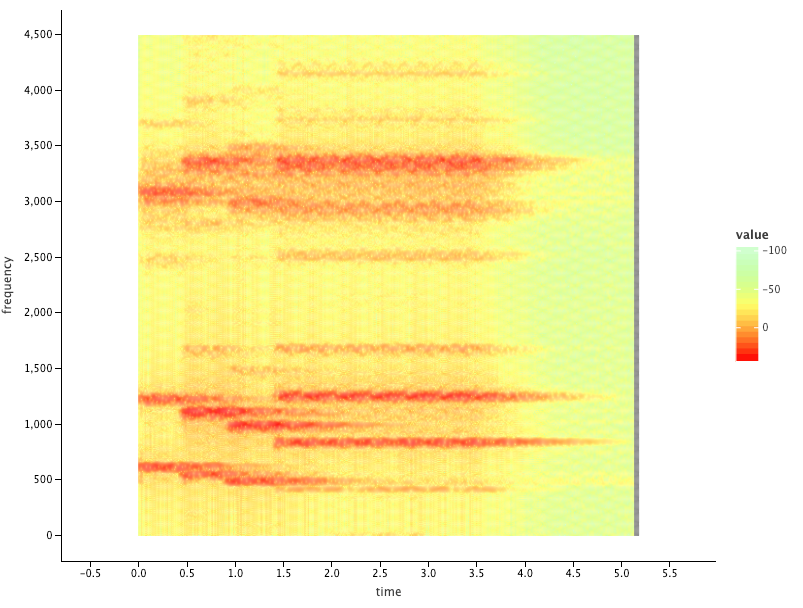

# Jupyter Wave

[  ](https://bintray.com/wavebeans/wavebeans/wavebeans/0.0.3.1605121111547/link)

<!-- START doctoc generated TOC please keep comment here to allow auto update -->
<!-- DON'T EDIT THIS SECTION, INSTEAD RE-RUN doctoc TO UPDATE -->
**Table of Contents**

- [Jupyter Plugin](#jupyter-plugin)
- [Running via Docker](#running-via-docker)
- [Runtime Configuration](#runtime-configuration)
- [API extension](#api-extension)
  - [Preview](#preview)
  - [Plot](#plot)
    - [Samples](#samples)
    - [FftSample](#fftsample)
  - [Data Frames](#data-frames)
- [Management server](#management-server)

<!-- END doctoc generated TOC please keep comment here to allow auto update -->

Jupyter + WaveBeans plugins and integration. It is based on:

* [kotlin-jupyter](https://github.com/Kotlin/kotlin-jupyter)
* [0.3.0-9c7e8b81](https://github.com/WaveBeans/wavebeans/tree/9c7e8b81) version of [WaveBeans]

Project status: underlying projects are in early alpha and beta stages, the extension should also be considered experimental at this point as well.

## Jupyter Plugin

The Kotlin Jupyter plugin supports adding libraries. This is how Jupyter-Wave runs, it is done via adding file `jupyter/jupyter-wave.json`. The file itself is a template which expects the library version and WaveBeans version specified during build time. The versions are specified in `gradle.properties` file.

Overall follow [kotlin-jupyter](https://github.com/Kotlin/kotlin-jupyter) documentation how to add the library to get some sense.

## Running via Docker

The recommended way to run Jupyter instance is via Docker. In `jupyter/` directory you can find `Dockerfile` which builds the image. 

There is a `build.sh` script that automates the build and run (via `andRun` parameter) of the docker image. Default run behaviour start everything that needs to make Jupyter accessible on `http://localhost:8888`.

In order to run by yourself use that commands as a base:

```bash
  cd jupyter/

  # prepare the library descriptor, assuming VERSION and WAVEBEANS_VERSION are populated with correct version in maven repos (local or remote)
  cat jupyter-wave.json.tpl | \
      sed "s/\$VERSION/$VERSION/" | \
      sed "s/\$WAVEBEANS_VERSION/$WAVEBEANS_VERSION/" \
      > jupyter-wave.json

  # build image
  docker build -t jupyter-wave .

  # run
  docker run -it \
    -p 8888:8888 \
    -p 2844:2844 \
    -e DROPBOX_CLIENT_IDENTIFIER=${DROPBOX_CLIENT_IDENTIFIER} \
    -e DROPBOX_ACCESS_TOKEN=${DROPBOX_ACCESS_TOKEN} \
    -e HTTP_PORT=2844 \
    -e MANAGEMENT_SERVER_PORT=2845 \
    -v "$(pwd)"/notebooks:/home/jovyan/work \
    -v ${HOME}/.m2:/home/jovyan/maven-local \
    -v "$(pwd)"/ivy_cache:/home/jovyan/.ivy2/cache \
    "jupyter-wave" \
    jupyter lab --NotebookApp.token=''
```

## Runtime Configuration

The evaluator can be parameterized via environment variables:

1. To start a streaming capabilities for preview functionality you need to specify the http port via `HTTP_PORT` environment variable, and do not forget to expose it if running docker or somewhere else. It'll start the [HTTP Service](https://wavebeans.io/docs/http/) with streaming capabilities.
    * If the HTTP service needs to be accessible on a different host, protocol, and/or port, specify `ADVERTISED_HTTP_HOST`, `ADVERTISED_HTTP_PROTOCOL` and `ADVERTISED_HTTP_PORT` environment variables accordingly. The host is defaulted to `localhost`, port to `HTTP_PORT` value, and protocol to `http`. 
2. Pre-populate DropBox configuration. DropBox File Driver is configured automatically if `DROPBOX_CLIENT_IDENTIFIER` and `DROPBOX_ACCESS_TOKEN` is specified.
3. To start up [management server](#management-server) specify `MANAGEMENT_SERVER_PORT` environment variable.

## API extension

On top of [WaveBeans API](https://wavebeans.io/docs/api/) there are a few functions available for convenient use within Jupyter notebooks.

### Preview

Preview allows you to listen to sample stream, it is available for any `BeanStream<Sample>`:

```kotlin
wave("dropbox:///song.wav").preview()
```

Certain things to keep in mind:

* Preview is available only for limited streams, and by default it limits any stream with 10 minutes. You can change it by specifying `maxLength` parameter if you need shorter or longer, also you may use [`trim()`](https://wavebeans.io/docs/api/operations/trim-operation.html) operation yourself, but if you need to do longer then default 10 minutes you would need to specify `maxLength` anyway:

```kotlin
440.sine().preview(maxLength = 1.s) // limit to 1 second
440.sine().trim(1000).preview() // already limited by 1 second
440.sine().trim(15, TimeUnit.MINUTES).preview(maxLength = 20.m) // need to extend the preview limit also
```

* The stream is evaluated with default frequency 44100Hz, to change that specify custom `sampleRate` parameter:

```kotlin
440.sine().preview(sampleRate = 22050.0f)
```

### Plot

There are builtin plotting abilities with [`lets_plot`](https://github.com/JetBrains/lets-plot-kotlin) library for some streams.

First of all you need to make sure the library is connected to the notebook:

```text
%use lets-plot
```

And then depending on the stream you may call `.plot()` function tuning the output.

#### Samples

You may plot out the waveform of any `FiniteStream<Sample>`.

Then you may use `.plot()` function, but before make sure you trimmed it:

```kotlin
440.sine()
    .trim(10)
    .plot()
```


Plot function allows you to specify the sample rate via `sampleRate` parameter, by default it is 44100Hz:

```kotlin
440.sine().trim(100).plot(sampleRate = 22050.0f)
```

#### FftSample

You may plot stream of `FftSample`s as a heat map using `.plot()` function on trimmed stream:

```kotlin
wave("dropbox:///2.wav")
    .window(1001, 501)
    .hamming()
    .fft(1024)
    .trim(2000)
    .plot(freqCutOff = 0 to 4500, gsize = 800 to 600)
```



Method has following parameters:

* `sampleRate` as `Float` - the sample rate to evaluate the stream with, by default `44100.0f`.
* `freqCutOff` as `Pair<Int, Int>` - the range of the frequencies to display, by default `0 to sampleRate.toInt() / 2`.
* `gsize` as `Pair<Int, Int>` - the size (x and y respectively) of the rendering image provided to `lets_plot.ggsize()`, by default `1000 to 600`.

You may also plot the FFT at specific time moment by specifying `offset` parameter. The `offset` has `TimeMeasure` type, i.e. `100.ms`, `3.s`, etc. 

```kotlin
wave("dropbox:///2.wav")
    .window(1001, 501)
    .hamming()
    .fft(1024)
    .trim(2000)
    .plot(offset = 1000.ms, freqCutOff = 0 to 4500)
```


Method has following parameters optional parameters on top:

* `sampleRate` as `Float` - the sample rate to evaluate the stream with, by default `44100.0f`.
* `freqCutOff` as `Pair<Int, Int>` - the range of the frequencies to display, by default `0 to sampleRate.toInt() / 2`.

### Data Frames

Whenever you want to plot yourself the data, you may get data in the format ready to be absorbed by `lets_plot` by calling `.dataFrame()` function:

* On `Sample` stream
     * The parameters are:
        * `sampleRate` as `Float` - the sample rate to evaluate the stream with, by default `44100.0f`.
     * The output table has following columns:
        * `time, ms` -- the time marker of the sample (Double).
        * `value` -- the double value of the sample (Double).
* On `FftSample` stream to look in motion:
    * The parameters are:
        * `sampleRate` as `Float` - the sample rate to evaluate the stream with, by default `44100.0f`.
        * `freqCutOff` as `Pair<Int, Int>` - the range of the frequencies to display, by default `0 to sampleRate.toInt() / 2`.
    * The output table has following columns:
        * `time` -- the time marker of the sample in milliseconds (Double)
        * `freq` -- the frequency in Hz (Double).
        * `value` -- the value in dB (Double).
* On `FftSample` stream to look at a specific time:
    * The parameters are:
        * `offset` -- the time marker to look at of `TimeMeasure` typr, i.e. `100.ms`, `3.s`, etc.
        * `sampleRate` as `Float` - the sample rate to evaluate the stream with, by default `44100.0f`.
        * `freqCutOff` as `Pair<Int, Int>` - the range of the frequencies to display, by default `0 to sampleRate.toInt() / 2`.
    * The output table has following columns:
        * `frequency, Hz` -- the frequency in Hz (Double).
        * `value, dB` -- the value in dB (Double).

## Management server

Management server allows you to change the [runtime configuration](#runtime-configuration) parameters of the running Wave instance via REST API. To start the server specify the `MANAGEMENT_SERVER_PORT` where it is going to be accessible. Once it is started you read or write values.

* To read the value perform the `GET` request to `http://server:port/config/VARIABLE_NAME`. The `VARIABLE_NAME` can be one of the predefined ones, or your own. The value is returned as a body, if the variable is not found 404 code is returned.
* To write the value perform the `POST` request to `http://server:port/config/VARIABLE_NAME`. The `VARIABLE_NAME` can be one of the predefined ones, or your own. The value shoudl be specified in the body of request.